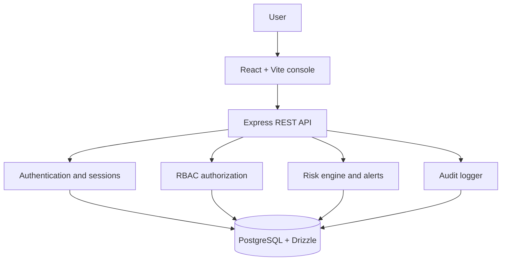

# Smart IAM Security Platform

**AI-Assisted Identity and Access Management System with Role-Based Access Control and Risk Monitoring**

Smart IAM is a full-stack enterprise-style IAM demonstration for showing authentication, authorization, least privilege, MFA, session control, risk scoring, alerting, and auditability in one runnable application.

## What is included

- Registration and secure password hashing with scrypt
- Session-cookie authentication, expiration, logout, and session revocation
- Development-friendly 6-digit MFA with short expiry and one-time use
- Backend permission checks based on user → role → permission relationships
- User, role, and permission administration
- Rule-based login risk scoring from 0–100
- Security alerts with acknowledgement/resolution state
- Synthetic security-event simulator; it never performs real attacks
- Dashboard aggregates, charts, security events, audit logs, and CSV export
- Responsive console UI with loading, empty, error, and forbidden states

## Architecture



## Stack

- React, Vite, TypeScript, Tailwind CSS, Recharts
- Express 5, Zod-generated request validation, pino logging
- PostgreSQL, Drizzle ORM, generated OpenAPI clients
- Cookie-based sessions and Node `crypto.scryptSync` password hashing

## Run

The Replit Run button starts both managed services. The documented commands are:

```bash
pnpm --filter @workspace/api-server run dev
pnpm --filter @workspace/smart-iam run dev
```

The API is available under `/api`; the web console is served at `/`.

## Demo accounts

All demo accounts use the development password `DemoPass123!`.

| Account | Email | Role | MFA |
| --- | --- | --- | --- |
| Super Admin | `admin@example.test` | SUPER_ADMIN | Off |
| Administrator | `administrator@example.test` | ADMIN | On |
| Manager | `manager@example.test` | MANAGER | Off |
| Employee | `employee@example.test` | EMPLOYEE | Off |
| Guest | `guest@example.test` | GUEST | Off |

When MFA is required in development, the verification response shows a temporary demo OTP in the UI. OTPs are hashed in the database and are not written to audit logs.

## Risk engine

The rule engine combines failed attempts, new devices, unusual times, rapid attempts, and synthetic high-risk events. Thresholds are:

- `0–30`: NORMAL
- `31–60`: MONITOR
- `61–80`: WARNING
- `81–100`: CRITICAL

Events at warning or critical levels create a security alert and are recorded in the audit trail.

## API and documentation

- Contract source: `lib/api-spec/openapi.yaml`
- Endpoint reference: `API_DOCUMENTATION.md`
- Extended documentation: `docs/`

## Validation

```bash
pnpm run typecheck:libs
pnpm --filter @workspace/api-server run typecheck
pnpm --filter @workspace/smart-iam run typecheck
pnpm --filter @workspace/api-server run build
```

The core demo path is: sign in as Super Admin, create or inspect identities, sign in as Employee to demonstrate a `403`, run the synthetic high-risk event, resolve its alert as an administrator, and export audit logs.

## Limitations and future enhancements

This project intentionally uses synthetic events and development OTP delivery. Production deployment should add an external email/SMS provider, stronger rate limiting, CSRF protection for cookie-authenticated mutations, password-reset delivery, centralized secret rotation, and database migrations managed through the deployment process.