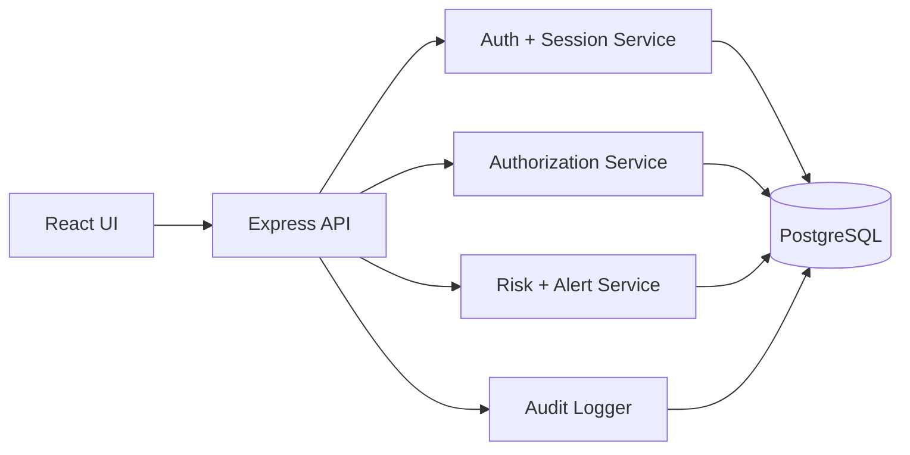

# System Architecture

The React/Vite web app calls the shared Express API through `/api`. The API validates request bodies with generated Zod schemas, evaluates cookie sessions, checks permissions through role mappings, runs the risk engine, writes audit events, and persists records in PostgreSQL through Drizzle ORM.

